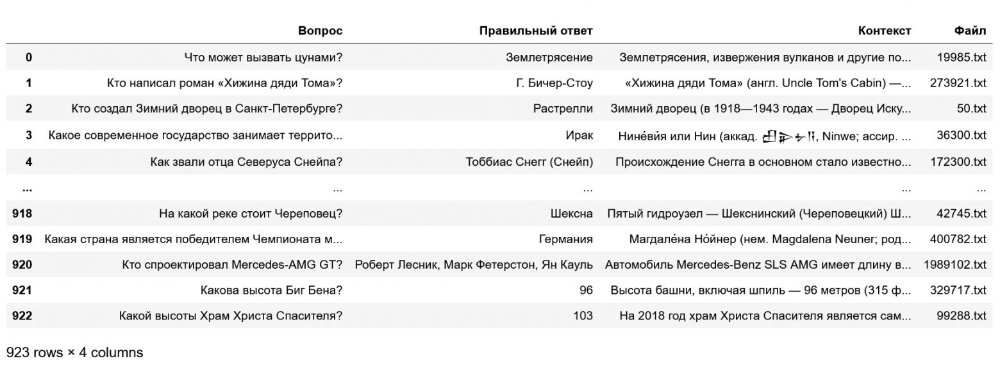

# Ru RAG Test Dataset
Датасет для тестирования русскоязычных RAG-систем.

Содержит следующие данные:
1. Файлы (в папка files) - спарсенные страницы русской Википедии.
Название файлов это id страницы. Открыть их можно по такому URL: https://ru.wikipedia.org/?curid=<id>
2. Датафрейм Pandas (сохраненный в формате Pickle - ru_rag_test_dataset.pkl) со следующими колонками:
    - Вопрос
    - Правильный ответ
    - Контекст - параграф, в котором содержится правильный ответ
    - Название файла, в котором содержится правильный ответ

Датасет собран на основе датасета RuBQ 2.0 (https://github.com/vladislavneon/RuBQ). Из него отбирались только те вопросы, ответ на которые содержатся только в одной статье, в одном параграфе.